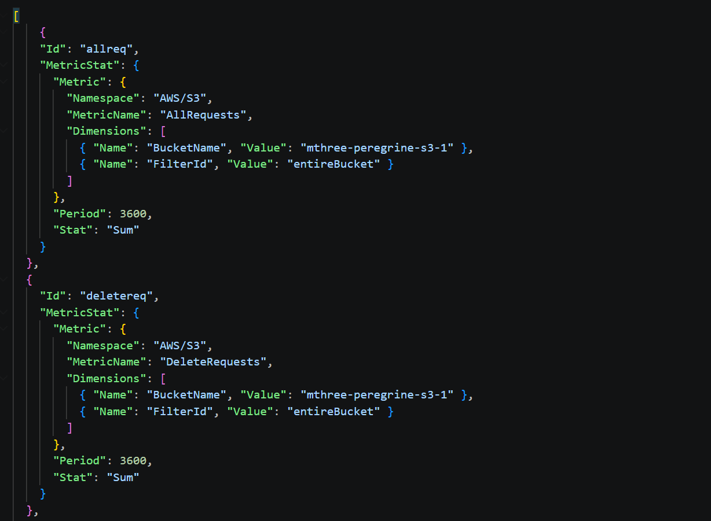
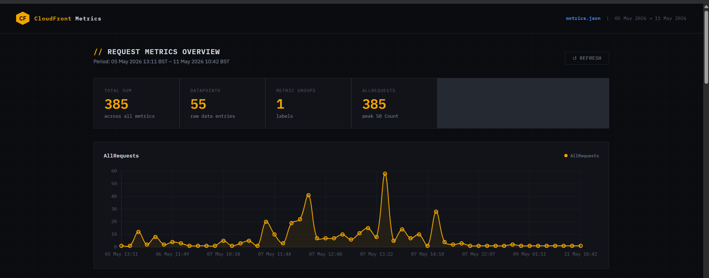

# Cloudfront Details

***FYI:*** *All the commands in this doc are for powershell. You will need to convert the commands if using any other operating system that isn't windows, because windows is special.*

# Commands used

> cypress  
> ├── e2e  
> ├── fixtures  
> └── support

> aws cloudwatch get-metric-statistics `                                                
> ├── --namespace AWS/S3 ` 
> ├── --metric-name AllRequests `  
> ├── --dimensions Name=BucketName,Value=mthree-peregrine-s3-1 Name=FilterId,Value=entireBucket `  
> ├── --start-time (Get-Date).AddDays(-7).ToUniversalTime().ToString("yyyy-MM-ddTHH:mm:ssZ") `  
> ├── --end-time (Get-Date).ToUniversalTime().ToString("yyyy-MM-ddTHH:mm:ssZ") `  
> ├── --period 420 `  
> ├── --statistics Sum `  
> ├── --output json `  
> └── > metrics.json                                  

Above command gets all requests to the s3 bucket over the last week and sums them together by day. The results are outputted to a metrics.json file to be used else where. Will show later.

> aws cloudwatch get-metric-data `
>>   --start-time (Get-Date).AddDays(-7).ToUniversalTime().ToString("yyyy-MM-ddTHH:mm:ssZ") `
>>   --end-time (Get-Date).ToUniversalTime().ToString("yyyy-MM-ddTHH:mm:ssZ") `
>>   --region us-east-1 `
>>   --metric-data-queries file://metrics_pull_requests.json `
>>   > metrics_requests.json                                
                       
Above does the same thing as the previous one, but instead of just getting the AllRequest metrics, it has the ability to get multiple metrics at once, based on the json file provided. Image of the json file 'metrics_pull_requests.json' given below for reference.

  

These are the only commands I have used to pull the metrics. I just played around with those to understand what is happening.

# Displaying the metrics

To display the metrics I got claude to spin up a quick static site that accepts the json files generated from the commands and displays it nicely on a page. See reference below for example of what it looks like.

  

The site should be able to accept any json file produced, using the two commands anyway. Can provide the site if you want to try anything out 👍.

