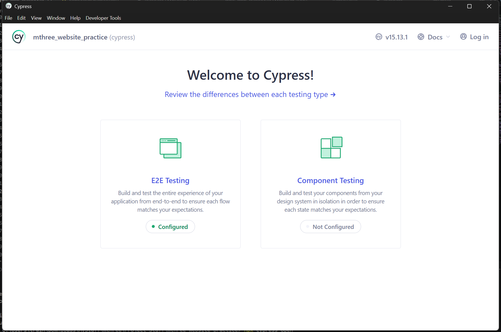
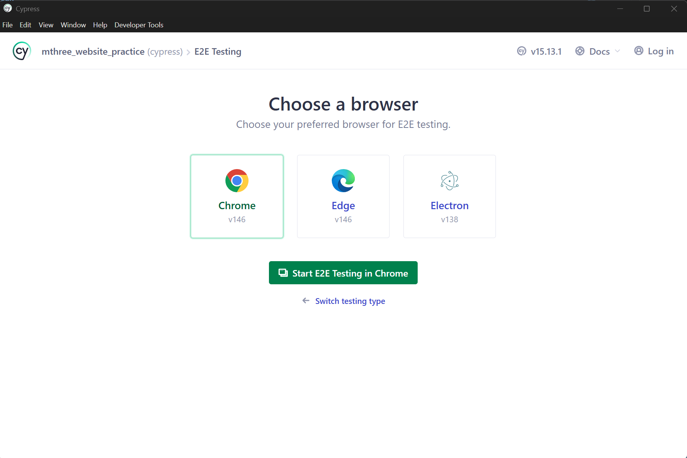
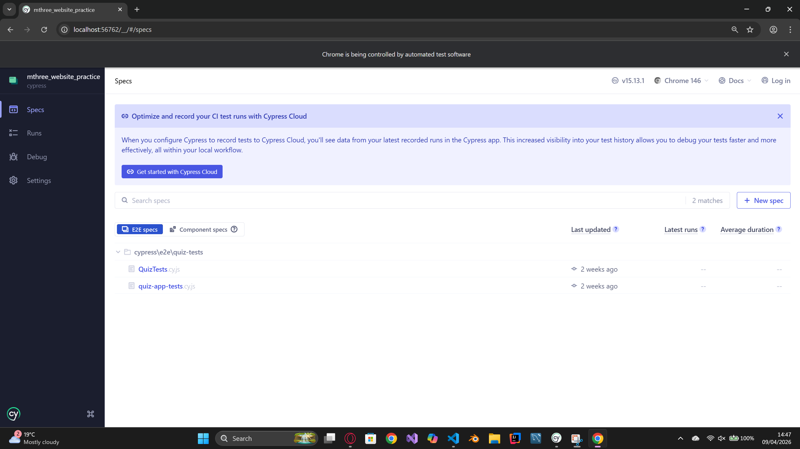

# Cypress Introduction

***FYI:*** *Everything in this markdown will be a basic cover for some of the stuff I used whilst using cypress, so it won't give the full image of what cypress can do. Please find below a link to the docs if you are interested on more information.*

***Cypress docs:*** *https://docs.cypress.io/app/get-started/why-cypress*

---

## What is Cypress?

Cypress is a testing tool that allows you to write code that simulates how a user interacts with your application. You define a series of actions and Cypress executes them automatically. These interactions are then used to verify that the application behaves as expected.

For example; in a quiz application, you could write a test where Cypress selects an incorrect answer. The test would then check that the application correctly identifies the answer as wrong and responds appropriately, such as displaying an error message or indicating the correct answer.

***Important Note:*** *Whilst writing your tests, you need to remember that cypress is meant to do the checks for you. Don't be like me and just write the interaction code and use your eyes to verify that everything is acting as you expect.*

---

## Getting Started

Getting ready with cypress is real simple. All you got to do is install the npm dependencies for your project.

> npm install cypress --save-dev

Above is the command you can use to install the cypress dependency.  

Following, you will need to run the so that you can get the files you need to start working with cypress.

> npx cypress open

Runs cypress and opens up an application window that looks like below.

  

From here, you will need to click on E2E testing. This will generate the folder structure that cypress will read your tests from. The file structure will look something like below.

***FYI:*** *Component testing are for frameworks and libraries that use components, such as; AngularJS and React. We haven't use frameworks or libraries in this mini hussle so you can ignore it.*

> cypress  
> ├── e2e  
> ├── fixtures  
> └── support

The ***e2e*** folder is where cypress will read your tests from, so that is the folder you need to store all your tests. If it doesn't create this on startup, you can just add it.  

***Fixtures*** is where you need to put any of your required assets that cypress needs to either interact with or test the application.  

The ***support*** folder contains any shared commands or imports that all your tests will need. For example; if you need to fill out a form for all your tests, you can create a command in the *'command.js'* file within support and call that command whenever you need to fill out the form.  

Once you have verified the folders are there, some examples will appear in the app but you can ignore those. Now brace yourself as what follows is the hardest step of this guide...  

Picking a browser to run your tests.

  

One cool thing about Cypress is that you can run your tests on different browsers to ensure that your application functions correctly no matter the browser the user runs it on. I believe that the list above represents the supported browsers that are downloaded on your device, but I digress if that isn't completely accurate.  

Once you select your browser, cypress opens up a test environment in the browser you selected and leaves you to run the tests that you want.

  

Now that you are here, all you got to do is write some tests and let cypress run them.

---

## Helpful code

Below are some notes that may help you with writing your testing code. This is just some real basic things for ideas. As a reference, you can find a link to my cypress branch for my project below.

***My cypress:*** *https://github.com/tworsum4yu/mthree_website_practice/blob/cypress/cypress/e2e/quiz-tests/quiz-app-tests.cy.js*

> example.cy.js

All you testing files in cypress end with *'cy.js'*.

> describe('*name*', () => {*your_code*})
> context('*name*', () => {*your_code*})

Both *describe* and *context* are used to group your tests together. *Describe* is typically used to group tests by function whereas *context* is used to group by specific scenarios. For cypress though, the do the exact same thing.

> it('*name*', () => {*your_code*})

*It* is what tells cypress that this is an individual test case you are looking to run.

> cy.visit('*url*')

Tells cypress to visit the url you have stated.

> cy.get('*tag_name*')

Tells cypress to find the elements on the page that match the *tag_name* such as; cy.get('h1') will retrieve all h1 elements on the page.

> cy.log('*log_message*')

Console log for cypress

> cy.window()

Captures the information that is currently held in the window. Useful if you have things to test in localStorage.

### Random final note

Cypress does not inherintly have a way to import files for you, so you are going to have to install the *'cypress-upload-file'* dependency and import it for use through the '*command.js*' file in *support*.

> import 'cypress-file-upload';

For '*command.js*'

> npm install --save-dev cypress-file-upload

Dependency download  

There are a bunch of these out and about so take a look to see what you can use to make your tests better.
