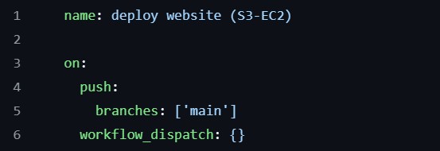
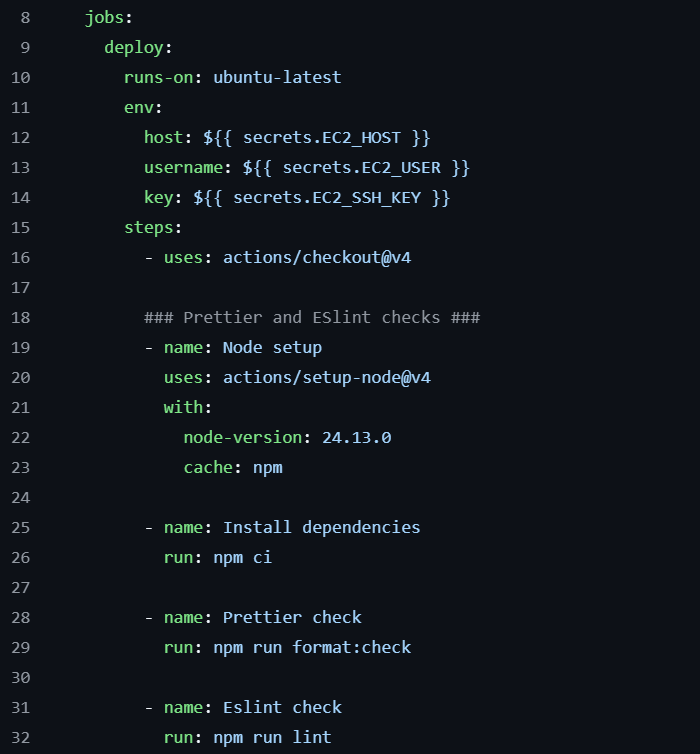

# Static Website Deployment Guide  
Deploying a static website using **S3**, **Docker**, **ECR**, and **EC2**

This guide walks through the full workflow for generating a static site, containerising it, pushing the image to AWS ECR, and running it on an EC2 instance.

## Information

### What is S3?
Amazon S3 (Simple Storage Service) is AWS’s scalable object‑storage service used to store and retrieve any amount of data at any time. Instead of thinking in terms of folders on a server, S3 stores files as objects inside buckets.

**Key points**
- Object storage — stores files like HTML, CSS, JS, images, videos, logs, backups, etc.
- Highly durable — designed for 11 nines of durability (99.999999999%).
- Infinitely scalable — you never run out of space.
- Pay‑as‑you‑go — you only pay for what you store and transfer.
- Static website hosting — can serve HTML/CSS/JS directly over the web.
- Integrates with AWS services — CloudFront, EC2, Lambda, ECR, and more.

### What is ECR?
Amazon ECR (Elastic Container Registry) is AWS’s fully managed Docker container registry. It stores, manages, and version‑controls your container images so they can be pulled by services like EC2, ECS, EKS, or Lambda.

**Key points**
- Private or public registry for Docker images
- Integrates seamlessly with AWS IAM for secure access
- Supports versioning and tagging of images
- Works directly with Docker CLI (docker push, docker pull)
- Often used with CI/CD pipelines for automated deployments
- Highly available and scalable — no registry servers to manage

### What is Docker?
Docker is a platform that lets you package applications into containers — lightweight, portable environments that include everything the app needs to run.

**Key points**
- Containers bundle code + dependencies into a single unit
- Ensures consistent behavior across machines (“works on my machine” solved)
- Much lighter than virtual machines
- Uses Dockerfiles to define how images are built
- Integrates with registries like Docker Hub and AWS ECR
- Ideal for microservices, deployments, and reproducible environments

### What is EC2?
Amazon EC2 (Elastic Compute Cloud) provides virtual servers in the cloud. You choose the OS, CPU, memory, storage, and networking, and AWS runs the machine for you.

**Key points**
- Virtual machines you can start, stop, and scale
- Supports Linux, Windows, and custom AMIs
- Works well for hosting apps, APIs, containers, and background jobs
- Integrates with ECR to run Docker containers
- Security groups act as virtual firewalls
- You pay only for the compute time you use

### What is Terraform?
Terraform is an Infrastructure as Code (IaC) tool that lets you define cloud resources using configuration files instead of clicking around in the AWS console.

**Key points**
- Declarative language (HCL) describes your infrastructure
- Supports AWS, Azure, GCP, and many other providers
- Enables version‑controlled infrastructure
- terraform plan shows changes before applying
- terraform apply creates or updates resources
- Great for reproducible, automated, and team‑friendly cloud setups

---

## Steps to follow

### 1. Website Generation  
A lightweight static site is all you need for this deployment.

**Steps**  
Create a simple project structure:
> /site  
> ├── index.html  
> ├── styles.css  
> └── script.js

- Use relative paths for all assets (e.g., `./images/logo.png`).
- Test locally by opening `index.html` in your browser.
- Confirm the site works without any backend dependencies.

---
## 2. Deployment file  
This section will give some quick details on getting started with the deployment file for the project.

  
*Figure 1: Intial Setup*

> name: *your_deployment_name*
Sets the name of the deployment workflow. This will be presented within the actions tab in github.

> on:  
> ├── push:  
> │   └── branches: ['main']  
> └── workfow_dispatch: {}

Tells github that this workflow should be run everytime new code is pushed to the main branch. In addition, the workflow_dispatch line allows the workflow to be run manually in the action tab in the repository.

  
*Figure 2: Intial Jobs to ensure code is correct*

> jobs:  
> └── deploy:

The jobs tag tells Github that what follows below are jobs to be run by Github. The deploy tag is just a name assigned to the following tasks, so that it is easier to track what jobs are running during the workflow.

---

## 3. Docker Containerisation  
Package your static site into a portable Docker image.

**Steps**  
- Create a `Dockerfile`:
FROM nginx:alpine
COPY site/ /usr/share/nginx/html

## 4. Terraform
